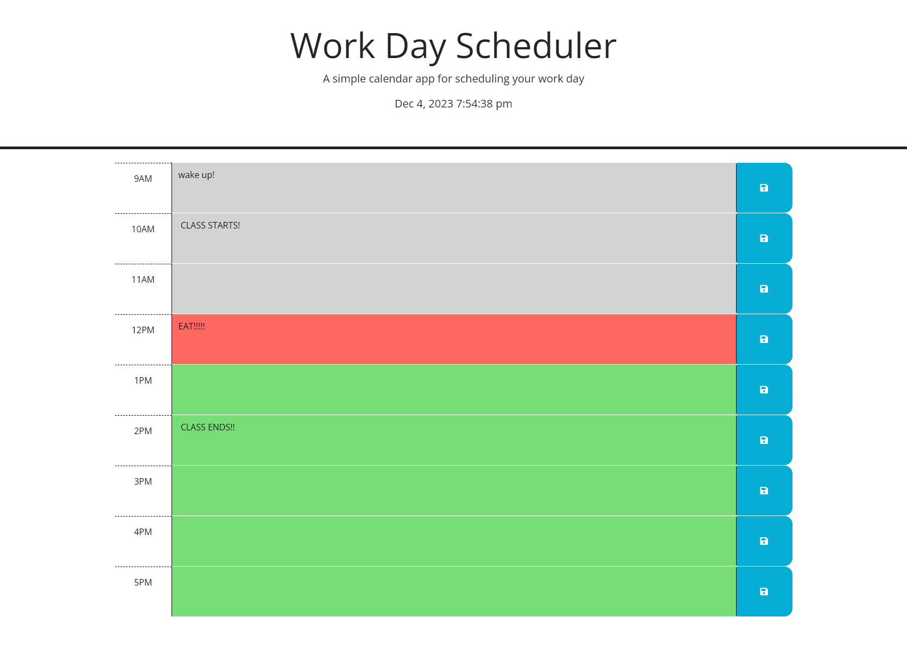

# <Maguire Wilson's Workday Scheduler'>

## Description

A simple webpage to schedule your workday!

## Table of Contents

- [Installation](#installation)
- [Usage](#usage)
- [Credits](#credits)
- [Features](#features)
- [screenshot](#screenshot)

## Installation

Using any web browser, open the provided URL.

## Usage

Enter and save events for your workday.

## Credits

Maguire Wilson.
Thanks to Xandromus for starter code. https://github.com/coding-boot-camp/crispy-octo-meme

## Features

Functional links [LINK TO ONLINE SITE] (https://macrowil.github.io/Work-Day-Scheduler/)

## Screenshot

